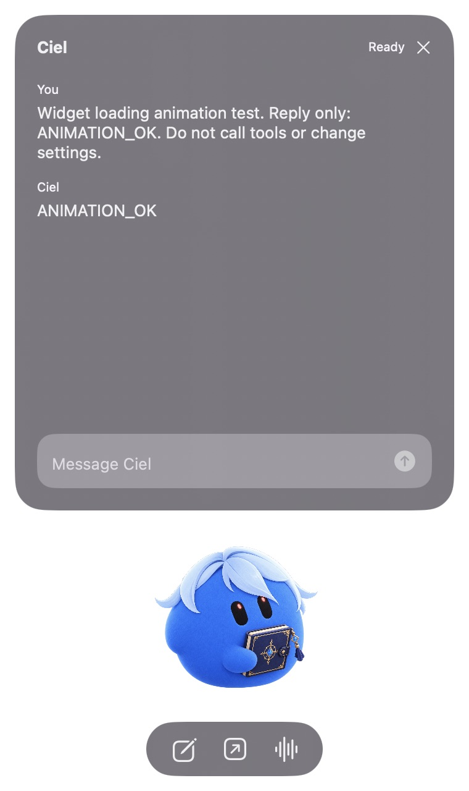

# Grokbot Widget

A local desktop companion for an existing Grok Bot. The first macOS prototype has a draggable floating character, expandable chat panel, hover feedback, a repeating pending animation, a loading indicator, and Grokbot handoff buttons. It connects to the existing bot through the official BDK extension.



The screenshot uses a custom local avatar and a synthetic test conversation. Supply your own image with `GROKBOT_AVATAR_PATH`; otherwise, the launcher looks for that bot's uploaded avatar in Grok Bot's local cache. If unavailable, it uses a simple blue dot.

## Local setup

Requires Node 22.13 or newer.

```sh
npm ci --ignore-scripts
cp .env.example .env
npm run bdk -- login
# Set GROKBOT_AGENT_NAME in .env to your existing bot’s exact name.
npm run check
npm run dev
```

In a second terminal, launch the native widget:

```sh
npm run widget
```

Requires macOS 14+ and Xcode command-line tools. Clicking the character or compose button opens chat. Drag the character or window background to move it anywhere on screen. A click still opens chat. The widget remembers its position after quitting, and opening chat keeps the panel within the current screen. Right-click for Quit. The generated app bundle is in ignored `.local/GrokbotWidget.app`; launch via the npm script so its environment is supplied.

The launcher builds the Swift app, starts it independently, and returns to the terminal. “Building for debugging” is the build mode. Closing the launcher terminal or pressing Ctrl+C after launch does not quit the widget. Relaunch with `npm run widget` after quitting. Keep the separate `npm run dev` server running for chat. Native output goes to ignored `.local/widget.log`.

Avatar lookup happens at launch and reads only Grok Bot's local roster and avatar cache under `~/Library/Application Support/Grok Bot`. Custom images take priority. The cache must contain an exact match for `GROKBOT_AGENT_NAME` and an available uploaded image. Missing caches, unsupported formats, built-in dot avatars, or ambiguous matches fall back to the generic dot. No credentials or private endpoints are used. This cache format is internal to the desktop app and may change; restart the widget after changing the bot's avatar.

Set `GROKBOT_AGENT_NAME` in `.env` to the exact existing bot name. Use the account that owns that bot. The BDK can create an empty bot when a name does not exist; `grokbot__list` only lists configured names and previously contacted bots, so it cannot verify account ownership.

The server binds to loopback on port 4317. It keeps state in ignored `.local/state`. Use the private browser playground link printed by BDK; do not publish the local server or its authentication token.

## Connection test

With the server running:

```sh
npm run smoke:list
npm run bdk -- call grokbot__ask --url http://127.0.0.1:4317/grokbot-widget --input '{"message":"This is an integration test from my local widget. Reply only: GROKBOT_WIDGET_OK. Do not call tools or change any settings.","wait_seconds":20}'
```

If the result is still running, call `grokbot__check` with `{"wait_seconds":20}`. Never interrupt unrelated work for this test. A result containing `created: true` means it reached a newly created bot, not the expected existing one.

## Credentials and private data

Use `bdk login`, `CURSOR_API_KEY`, or `CURSOR_API_KEY_FILE`. BDK login stores a dashboard-revocable credential outside this repository. `.env`, local session state, logs, and `memory/` are ignored. `.env.example` contains placeholders only. Do not put credentials in source code, shell arguments, browser assets, committed logs, or screenshots.

Before publishing, review both tracked files and Git history for private material. Bot names, IDs, and personal artwork should be supplied through local configuration rather than embedded in the shared project.

## Verified from BDK 0.2.18

The published `cursor-grokbot-agents` extension provides ask, check, list, and interrupt tools. It consults the authenticated account's Grok Bot using its existing conversation, memory, and tools. Only delivered replies are returned; the bot's internal work is not exposed. Busy bots are not sent another message. The extension requires the local runtime.

Live verification passed: the direct BDK test returned the requested marker from an existing bot (`created` was absent), and a second message sent through the native UI appeared as the expected reply in its chat panel. TypeScript checking and native compilation passed.

The open button launches Grokbot. Set `GROKBOT_OPEN_URL` to a verified `grokbot://` link to target a specific conversation. Voice uses the same handoff; start the call inside Grokbot. No native voice embedding or universal background event feed has been verified. Widget chat history is held in memory; BDK keeps private local session state.

Source: https://www.npmjs.com/package/@cursor/bdk (bundled docs/guides/grokbot-agents.md).

## License

MIT. See [LICENSE](LICENSE).
